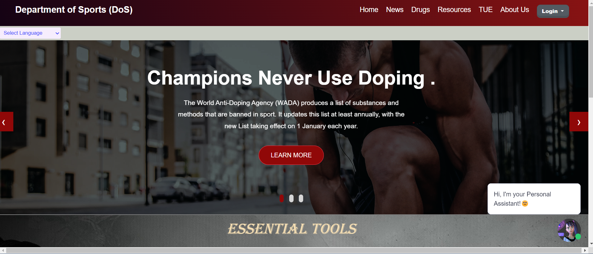
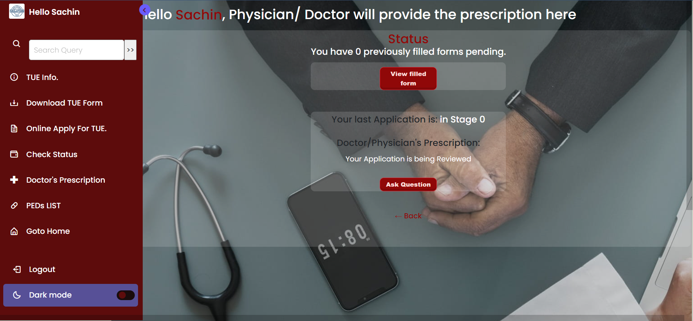
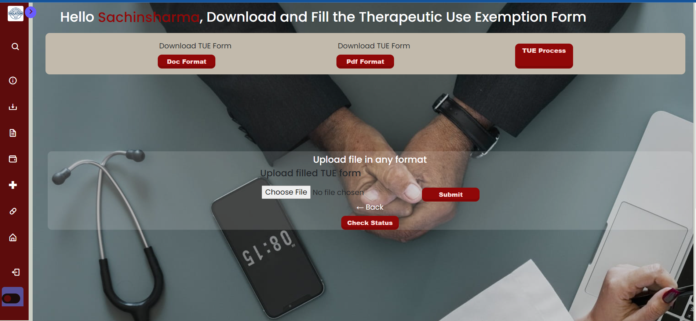
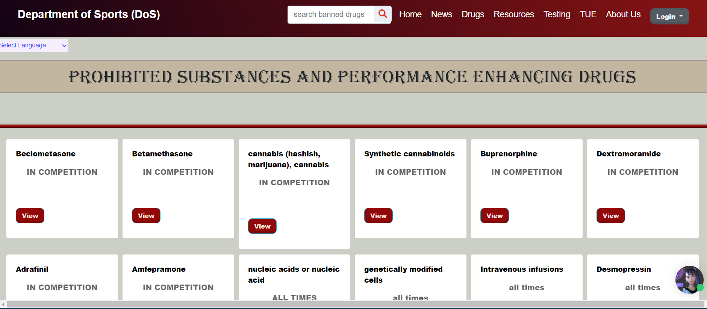

# Anti_Doping_Application For Ministry of Sports and Youth Affair , Government of India 
This Project is built for Ministry of Sports and Youth Affair, Government of India during Smart India Hackathon 2022


## Introduction:
The Anti-Doping web application project is aimed at promoting clean sports and raising awareness about the negative effects of doping on athletes' health and performance. The project was developed using Django, SQLite3, HTML, CSS, and JavaScript technologies in the Smart India Hackathon 2022 competition. This report presents an overview of the project, its features, and the technologies used in its development.




*Features:*

The Anti-Doping web application project has several features, including:

- User Authentication: The web application has a login system that allows users to create accounts, log in, and manage their profiles.

- Athlete Profile: Athletes can create profiles on the web application, which include their personal information, sports achievements, and anti-doping pledges.

- Anti-Doping Pledge: Athletes can take an anti-doping pledge, committing to the principles of clean sports and fair play.

- Education Resources: The web application provides resources on anti-doping education, including articles, videos, and quizzes.

- Doping Control Forms: The web application has a form for doping control officers to report the results of doping tests.


## Getting Started---:

1 To run the Anti-Doping web application locally, follow these steps:
```
git clone https://github.com/your-username/Anti_Doping_Application_Sih.git

```
2 Change directory into the project:

```
cd Anti_Doping_Application_Sih
```

3 Install the required dependencies: 

```
pip install -r requirements.txt

```
4 Create the SQLite3 database:
```
python manage.py migrate
```
5 Create a superuser for the application:
```
python manage.py createsuperuser
```
6 Start the development server:
```
python manage.py runserver
```


## Technologies Used:
The Anti-Doping web application was developed using the following technologies:

- **Django:** Django is a Python-based web framework that provides a high-level of abstraction for web development. It was used to handle the backend logic of the web application, including user authentication, database management, and form handling.

**SQLite3:** SQLite3 is a lightweight database management system that was used to store and manage the web application's data.

HTML, CSS, and JavaScript: These technologies were used to create the front-end user interface of the web application. HTML was used for creating the structure of the web pages, CSS for styling them, and JavaScript for adding interactivity.

#Conclusion:
The Anti-Doping web application project is an important contribution to the promotion of clean sports and the fight against doping in sports. It provides a platform for athletes to take an anti-doping pledge, access educational resources, and report doping violations. The project was developed using Django, SQLite3, HTML, CSS, and JavaScript technologies in the Smart India Hackathon 2022 competition. Overall, the project showcases the power of technology to promote positive social change and highlights the importance of clean sports and fair play.

## look of the Project 

## User Dashboard 









